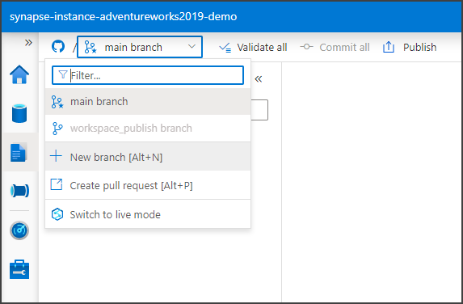
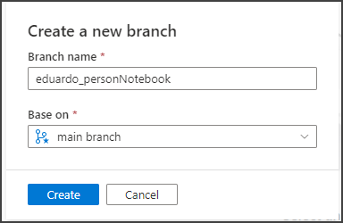
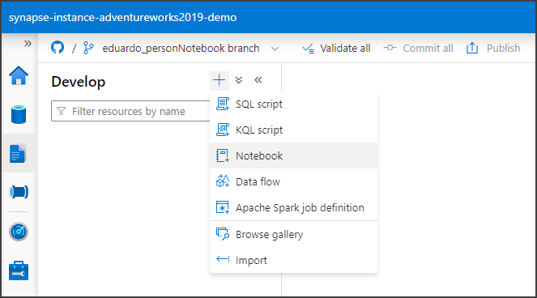
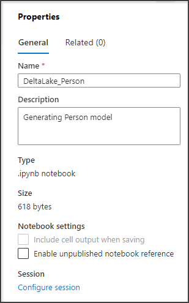
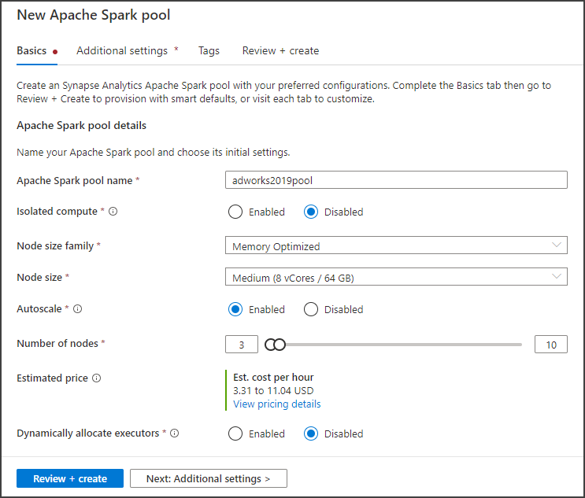

# Synapse_AdventureWorks2019
Synapse demo using AdventureWorks2019 data

In this repo we demonstrate some Azure Synapse Analytics functionality using AdventureWorks2019 Database data.

### Table of Contents

**[Create Synapse Notebook](#create-synapse-notebook)**<br>
**[Create Persons Notebook](#create-person-notebook)**<br>

## Create Synapse Notebook

In this step we will create two notebooks. One to process the Persons data and another to process the Products data. 

As part of these notebooks we will use Delta Lake format and the result will be the creation of two models, one for Persons and one for Products.

Lets get started.

## Create Person Notebook

Lets start by creating a new branch this time.

Go to the Develop tab and expand the source control dropdown that has main branch on it. Select New branch.



Name the new branch. I recommend to put your alias to avoid a conflict with other people branches, and put a name related to the feature you will develop. I am calling it "eduardo_personNotebook" and click Create.



Standing on the new branch, on the Develop tab, click on the + button and select Notebook.



Enter a name and description.



Lets start coding the notebook. Lets create a variable to read from the Person file as well as from the PersonEmailAddress file. Lets also create three variables for the folders Bronze, Silver and Gold for the Delta Lake.
Write this code in the first cell.

```python
#Set up file paths
personEmailRawPath = "abfss://adventureworks2019@datalakeadworks2019demo.dfs.core.windows.net/PersonEmailAddress.parquet"
personRawPath = "abfss://adventureworks2019@datalakeadworks2019demo.dfs.core.windows.net/PersonPerson.parquet"
personBronzeTablePath = 'abfss://adventureworks2019@datalakeadworks2019demo.dfs.core.windows.net/delta/personBronzeTable'
personSilverTablePath = 'abfss://adventureworks2019@datalakeadworks2019demo.dfs.core.windows.net/delta/personSilverTable'
personGoldTablePath = 'abfss://adventureworks2019@datalakeadworks2019demo.dfs.core.windows.net/delta/personGoldTable'
```

To run that code, expand the Attach to dropdown on the top of the Notebook and select Manage pools.

That takes you to the Manage tab, and the Apache Sparks pools page in ther. Click the New button.


On the New Apache Sparks pool page, enter a name for the pool and click Review + create.



On the Review + create page click the Create button. That will submit the request and create the Apache Spark pool. Wait until the deployment is completed.

Once the deployment is completed. Go back to the Develop tab, expand the Attach to dropdown and select the newly deployed Apache Spark pool. Then click the Run all button to execute the cell.


Then click the Run all button to execute the cell. It will take some time to connect, to start the session and to exectue the notebook.

Once the execution is completed, Commit your changes.


Lets create another cell by pressing the + Code button and lets read the person's data into a dataframe and to display it. Press the run cell button on the left of the cell. Lets execute every new cell you create during the rest of this tutorial.

```python
%%pyspark
df = spark.read.load(personRawPath, format='parquet')
display(df.limit(10))
```

In a new cell, lets save that dataframe into the Bronze folder. Lets use Delta format. Run the cell. The code will look like this:

```python
#Save as Delta Table
df.write.mode("overwrite").format("delta").save(personBronzeTablePath)
```

Next lets create another cell and read from the bronze folder into a new dataframe. Run the cell

```python
#Load Bronze table into dataframe
rawPersonDF = spark.read.format("delta").load(personBronzeTablePath)
rawPersonDF.show()
```

Lets start manipulating the data. In a new cell lets drop the rowguid column. 

```python
#Drop id field
personDF2 = rawPersonDF.drop('rowguid')
personDF2.show()
```

And next lets save the Silver table in another cell.

```python
#Save Silver table
personDF2.write.mode("overwrite").format("delta").option("overwriteSchema", "true").save(personSilverTablePath)
```

Lets create another cell to drop the ModifiedDate column.

```python
#Dropping ModifiedDate column
personDF3 = personDF2.drop('ModifiedDate')
personDF3.show()
```

And next, in a new cell lets combine first, moddle and last name into a new FullName column. Lets drop the three previous columns.

```python
#Concating Region Province Country and droping extra columns
from pyspark.sql.functions import concat_ws,col
personDF4 = personDF3.withColumn("FullName",concat_ws(" ",col("FirstName"),col("MiddleName"),col("LastName"))).drop("FirstName").drop("MiddleName").drop("LastName")
    
personDF4.show()
```

Lets create a new cell to modify the silver table with the resulting dataframe.

```python
#Update Silver Table
personDF4.write.mode("overwrite").format("delta").option("overwriteSchema", "true").save(personSilverTablePath)
```

In a new cell lets group by the data by PersonType and EmailPromotion, counting the elements in each group and sorting the result by EmailPromotion.

```python
personDF5 = personDF4.groupBy("PersonType", "EmailPromotion").count().sort("EmailPromotion")
personDF5.show()
```

And in the last cell lets save the result in the Golden folder.

```python
#Save Gold table
personDF5.write.mode("overwrite").save(personGoldTablePath)
```

To double check the entire notebook, press the Run All button at the top of the notebook to execute every cell.

The notebook should run successfully.


Commit your changes to the Git repo.

As a result of executing this notebook, if you go to the Data tab, click on the Linked services, expand the Azure Data Lake Storage Gen 2, expand the workspace default storage (I called it synapse-instance-adventureworks2019-demo), click on the adventureworks2019 folder, then on the delta folder and then in the personGoldTable folder, you should see the parquet files with the newly generated model.


Go back to the notebook and press the Commit button.

Once the commit completed, expand the source control dropdown and lets create a pull request to merge this changes into the Main branch. Click Create pull request.


That will open a new browser tab and take you to GitHub, where everything will be ready for you to create the pull request. Click on the Create pull request button and follow the steps.

Once the pull request is created, merge it and delete the branch. You are all set.

Go back to the browser tab where you have Synpase Studio, expand the source control dropdown and select main branch. The dropdown will refresh and the deleted branch will dissapear, and now you are in the main branch with the newly created notebook.


